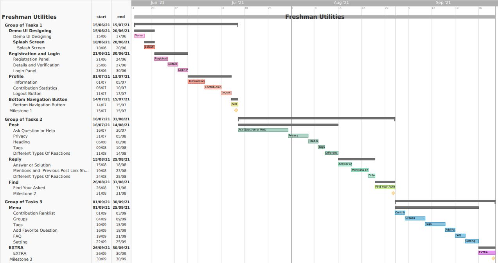

# G17-Freshman-Utilites

## Expected Timeline

## Feature Description
* **splash screen:**  A splash screen will appear while the program is launching.
* **Registration Panel :** By using university mail,department name,registration number one can register.
* **Details and Verification:** User have to give some details *not editable* and it will verify through e-mail
* **Login Panel:** Login Section for Registered users.
* **Information:** Few *Editable* Login Panel information i.e. mobile no , address and others.
* **Contribution Statistics:**  Upvote and Downvote information based on post and contribution.
* **Logout Button:** Logout...
* **Bottom Navigation Button:** users can go to different screens of application through that.
* **Ask Question or Help:** *Main Feature* - user can ask their questions and problems for solution.
* **Privacy:** public , department , batch , section types of privacy for audiance.
* **Heading:** users have to write a heading for their post.
* **Tags:** different types of tags for post.
* **Different Types Of Reactions:** upvote :heavy_check_mark:, downvote :x:.
* **Answer or Solution:** users can ask their problems and questions for solution.
* **Mentions and Previous Post Link Sharing:** **@mention** and can previous post link sharing section.
* **Different Types Of Reactions:** upvote , downvote and useful for *comments*.
* **Find Your Asked:** users can find their previously posted queries.
* **Contribution Ranklist:** top contributors list.
* **Add Favorite Question:** users can save their favourtive or helpful post for future.
* **Setting:** notifications setting, account delition :warning:.
* *Extra:* based on demand.

Report on Learning Pre-requisites
----------------------------------

SL | Learning Task | Description | Status | Comment |
--:|:--------------|:------------|:------:|---------|
1  | Android Basics    | Basics of Android XML, JAVA Language |   ||
2  | Android Basic Multiscreen Apps    | Intent and Different Types of Views (i.e. Adapter View ) , Fragments |   ||
3  | Android Basic Designing    | Basic UI/UX Design , Android Material Designing |   |2018331045|
4  | Android Basic Data Storage    | Basics of Firebase | ||
5  | Android Basic API  | Different Types Of APIs (i.e. Email API)  |  |2018331081|
